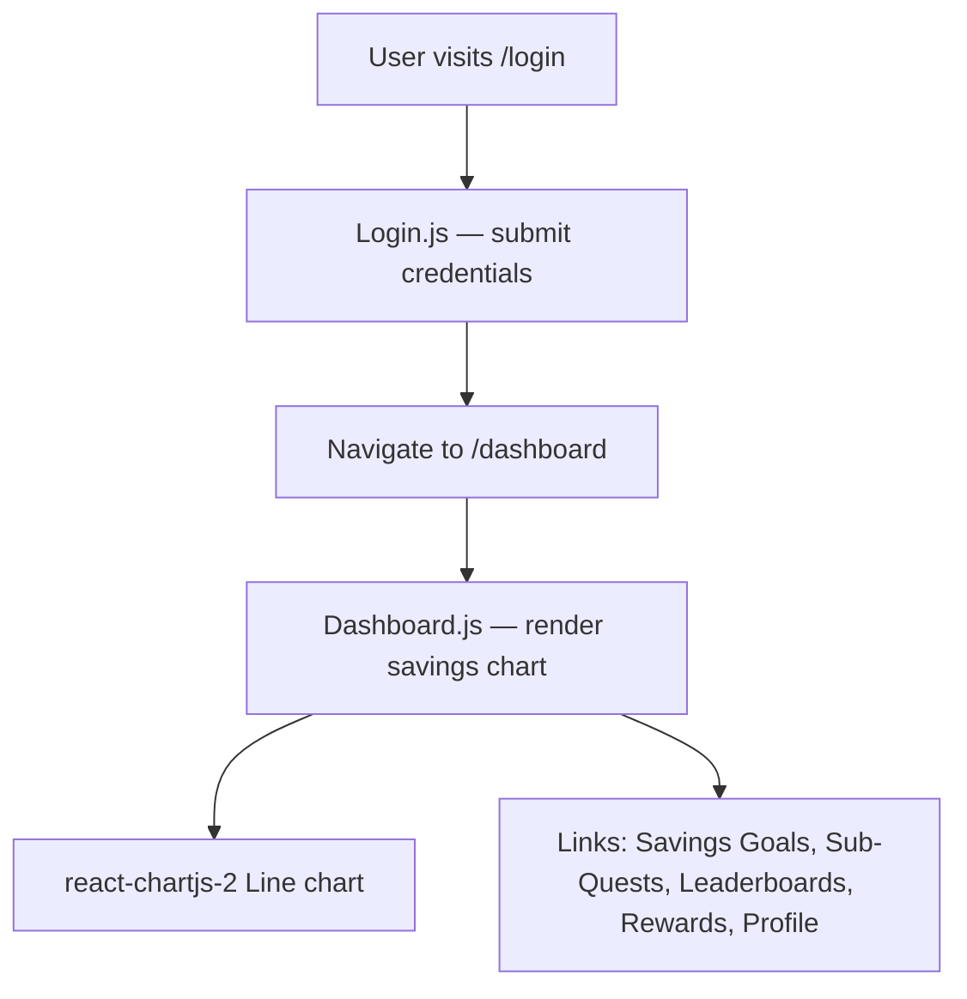

# Reboot-Pension-App


## Overview
Pension engagement is notoriously low because traditional interfaces are dry, impersonal, and offer little motivation to save. This application is a hackathon demo that reimagines pension management as a gamified experience — users can view their savings growth on a dashboard, track savings goals, complete sub-quests, and compete on leaderboards. It is aimed at developers and hackathon participants exploring how gamification can drive better financial behaviours.

## Getting Started

### Prerequisites
- [Node.js](https://nodejs.org/) v16 or later
- [npm](https://www.npmjs.com/) (bundled with Node.js)

### Installation
```sh
$ cd hackathon-demo-app
$ npm install
```

### Usage
```sh
$ npm start
// App starts at http://localhost:3000
// Navigate to /login, then /dashboard to explore the UI
```

## Structure
```sh
Reboot-Pension-App/
├── 📄 README.md
└── hackathon-demo-app/          # React application (Create React App)
    ├── 📄 package.json          # Dependencies: React 18, MUI, react-chartjs-2, react-router-dom
    ├── public/                  # Static assets and HTML template
    └── src/
        ├── 📄 App.js            # Root component — router with /login and /dashboard routes
        ├── 📄 index.js          # React entry point
        └── pages/
            ├── 📄 Login.js      # Login form (placeholder auth)
            └── Dashboard/
                ├── 📄 Dashboard.js  # Savings chart + navigation links
                └── 📄 Dashboard.css # Dashboard styles
```

## How It Works


## References
- [Create React App](https://github.com/facebook/create-react-app) — project bootstrapped with CRA
- [MUI (Material UI)](https://mui.com/) — component library used for UI elements
- [react-chartjs-2](https://react-chartjs-2.js.org/) — Chart.js React wrapper used for the savings line chart
